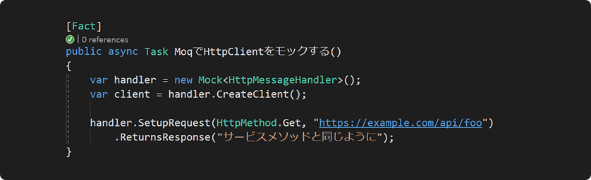

# Moq.Contrib.HttpClient

[![NuGet][nuget badge]][nuget] [![ci build badge]][ci build]

[English](README.md)

MoqでHttpClientとIHttpClientFactoryのテストダブルを作るための拡張メソッドです

かつて、HttpClientをモックすることが[驚くほど難しかって][dotnet/runtime#14535]、解決方法はHttpClientそのものをモックする代わりにラッパーを作ること、あるいは他のHTTPライブラリで完全に置き換えることでした。このパッケージはHTTPリクエストのモックをサービスメソッドと同じように簡単にする拡張メソッドを提供する

- [インストール](#インストール)
- [API](#api)
  - [リクエスト](#リクエスト)
  - [レスポンス](#レスポンス)
- [用例](#用例)
  - [一般的な使用法](#一般的な使用法)
  - [クエリパラメータやヘッダーやJSONボディでリクエストをマッチする](#クエリパラメータやヘッダーやjsonボディでリクエストをマッチする)
  - [リクエストのシークエンスをセットアップする](#リクエストのシークエンスをセットアップする)
  - [リクエストボディに基づいてレスポンスを書く](#リクエストボディに基づいてレスポンスを書く)
  - [IHttpClientFactoryの使い方](#ihttpclientfactoryの使い方)
    - [概要](#概要)
    - [ファクトリーをモックする方法](#ファクトリーをモックする方法)
    - [名前付きクライアント](#名前付きクライアント)
  - [統合テスト](#統合テスト)
  - [より詳細な例](#より詳細な例)
- [ライセンス](#ライセンス)

## インストール

`Install-Package Moq.Contrib.HttpClient`

または `dotnet add package Moq.Contrib.HttpClient`

## API

Moqの普通のメソッドにリクエスト版とレスポンス版が追加される：

- **Setup** → SetupRequest, SetupAnyRequest
- **SetupSequence** → SetupRequestSequence, SetupAnyRequestSequence
- **Verify** → VerifyRequest, VerifyAnyRequest
- **Returns(Async)** → ReturnsResponse

### リクエスト

リクエストのヘルパーはすべて同じオーバーロードがある：

```csharp
SetupAnyRequest()
SetupRequest([HttpMethod method, ]Predicate<HttpRequestMessage> match)
SetupRequest(string|Uri requestUrl[, Predicate<HttpRequestMessage> match])
SetupRequest(HttpMethod method, string|Uri requestUrl[, Predicate<HttpRequestMessage> match])
```

`requestUrl`は正確なURLをマッチして、`match`述語はクエリパラメータやヘッダーでマッチ出来てリクエストボディをチェックするためにasyncになれる

### レスポンス

レスポンスのヘルパーはStringContent、ByteArrayContent、StreamContent、それともステータスコードだけを送ることを簡単にする：

```csharp
ReturnsResponse(HttpStatusCode statusCode[, HttpContent content], Action<HttpResponseMessage> configure = null)
ReturnsResponse([HttpStatusCode statusCode, ]string content, string mediaType = null, Encoding encoding = null, Action<HttpResponseMessage> configure = null))
ReturnsResponse([HttpStatusCode statusCode, ]byte[]|Stream content, string mediaType = null, Action<HttpResponseMessage> configure = null)
```

`statusCode`が省略されると200 OKにディフォルトする。`configure`アクションがレスポンスのヘッダーを設定するように使える

## 用例

### 一般的な使用法

```csharp
// HttpClientで送ったリクエストがモックされるハンドラのSendAsync()中に通る
var handler = new Mock<HttpMessageHandler>(MockBehavior.Strict);
var client = handler.CreateClient();

// すべてのリクエストに404を送る簡単な例え
handler.SetupAnyRequest()
    .ReturnsResponse(HttpStatusCode.NotFound);

// JSONを返すエンドポイントへのGETリクエストをマッチする (200 OKにデフォルトする)
handler.SetupRequest(HttpMethod.Get, "https://example.com/api/stuff")
    .ReturnsResponse(JsonConvert.SerializeObject(model), "application/json");

// 任意なconfigureアクションでレスポンスにもっとのヘッダーを設定する
handler.SetupRequest(HttpMethod.Get, "https://example.com/api/stuff")
    .ReturnsResponse(bytes, configure: response =>
    {
        response.Content.Headers.LastModified = new DateTime(2022, 3, 9);
    });
```

<blockquote>
<details>
<summary>💡 なぜHttpClientのためにMockBehavior.Strictを使うべき</summary>
<br />

以下の点を考慮します：

```csharp
handler.SetupRequest(HttpMethod.Get, "https://example.com/api/foos")
    .ReturnsJsonResponse(expected);

List<Foo> actual = await foosService.GetFoos();

actual.Should().BeEquivalentTo(expected);
```

このテストは以下の例外で予期せず失敗する：

```
System.InvalidOperationException : Handler did not return a response message.
```

なぜならMoqはセットアップがマッチしない場合既定値を返すLooseモードがデフォルトですが、HttpClientはハンドラからnullを受け取るとInvalidOperationExceptionをスローする

MockBehavior.Strictに変更したら：

```diff
- var handler = new Mock<HttpMessageHandler>();
+ var handler = new Mock<HttpMessageHandler>(MockBehavior.Strict);
```

もっと便利な例外をもらって、送ったリクエストも付いてる (ここ、URLがfoosではなくfooとミスされた)：

```
Moq.MockException : HttpMessageHandler.SendAsync(Method: GET, RequestUri: 'https://example.com/api/foo', Version: 1.1, Content: <null>, Headers:
{
}, System.Threading.CancellationToken) invocation failed with mock behavior Strict.
All invocations on the mock must have a corresponding setup.
```

</details>
</blockquote>

### クエリパラメータやヘッダーやJSONボディでリクエストをマッチする

```csharp
// もっと複雑にマッチするための述語を受け取れる
handler.SetupRequest(r => r.Headers.Authorization?.Parameter != authToken)
    .ReturnsResponse(HttpStatusCode.Unauthorized);

// 述語がボディをチェックするためにasyncにもなれる
handler
    .SetupRequest(HttpMethod.Post, url, async request =>
    {
        // このセットアップは予期されるIDのあるリクエストのみをマッチする
        var json = await request.Content.ReadAsStringAsync();
        var model = JsonConvert.DeserializeObject<Model>();
        return model.Id == expected.Id;
    })
    .ReturnsResponse(HttpStatusCode.Created);

// とくにはクエリパラメータのあるURLをマッチしたら便利です
handler
    .SetupRequest(r =>
    {
        Url url = r.RequestUri;
        return url.Path == baseUrl.AppendPathSegment("endpoint") &&
            url.QueryParams["hoge"].Equals("piyo");
    })
    .ReturnsResponse("stuff");
```

最後のはクエリ文字列のチェックに役立つ[Flurl]というURLビルダーのライブラリを使う。これ以上の説明は[リクエスト拡張のテスト][RequestExtensionsTests]のMatchesCustomPredicateとMatchesQueryParametersを見てください

### リクエストのシークエンスをセットアップする

Moqは2種類のシークエンスがある：

1. `SetupSequence()` は順に値を返す一つセットアップを作る
2. `InSequence().Setup()` は必ず順にマッチするように複数のセットアップを`When()`条件で作る

両方がサポートされるけど、サービスメソッドのように、普段は普通のセットアップが最適です。互いに独立しているリクエスト（つまり、前リクエストに返された情報に依存していない）が特定の順序でマッチする必要がある場合は後者が便利です

用例は[シークエンス拡張のテスト][SequenceExtensionsTests]を見てください

### リクエストボディに基づいてレスポンスを書く

もっと複雑のレスポンスのためには普通のReturnsがリクエストのヘルパーと一緒に使える：

```csharp
handler.SetupRequest("https://example.com/hello")
    .Returns(async (HttpRequestMessage request, CancellationToken _) => new HttpResponseMessage()
    {
        Content = new StringContent($"こんにちは、{await request.Content.ReadAsStringAsync()}")
    });

var response = await client.PostAsync("https://example.com/hello", new StringContent("世界"));
var body = await response.Content.ReadAsStringAsync(); // こんにちは、世界
```

### IHttpClientFactoryの使い方

#### 概要

HttpClientはIDisposableなので`using`中によく入れられてしまうが、直感に反して、これは間違うし[ソケットを使い果たしていることにつながる可能性があるんです][httpclientwrong]。一般の忠告は単一のHttpClientを再利用することですが、そうしたらDNSの変更に反応しない

ASP.NET Coreが「HttpClientのライフタイムを手動で管理するときに発生する一般的なDNSの問題を回避のために基礎となるHttpClientMessageHandlerインスタンスのプーリングとライフタイムを管理する」[IHttpClientFactory]を導入する。ボーナスとして、これが[ミドルウェアをプラグインするHttpClientの能力][middleware]をもっととっつきやすいにする。例えば、再試行と失敗を自動的に処理するために[Polly]を使うこと

#### ファクトリーをモックする方法

クラスが単にIHttpClientFactoryによって注入したHttpClientを受け取ると、特に何もする必要がない。コンストラクタがファクトリーそのものを受け取る場合は、同じようにモックできる：

```csharp
var handler = new Mock<HttpMessageHandler>();
var factory = handler.CreateClientFactory();
```

このファクトリーがクラスに渡されたり[AutoMockerによって注入されたり][AutoMocker]できる。`factory.CreateClient()`を呼び出すコードがモックなハンドラを使うクライアントを受ける

#### 名前付きクライアント

`CreateClientFactory()`という拡張メソッドはディフォルトのクライエントを返すようにセットアップされたモックを返す。[名前付きクライアント][named clients]を使っている場合は次のようにセットアップを追加できる：

```csharp
// 名前付きクライアントも設定する（デフォルトを無効にする）
Mock.Get(factory).Setup(x => x.CreateClient("api"))
    .Returns(() =>
    {
        var client = handler.CreateClient();
        client.BaseAddress = ApiBaseUrl;
        return client;
    });
```

> ※「Extension methods (here: HttpClientFactoryExtensions.CreateClient) may not be used in setup / verification expressions.」というエラーが出たら、上に`"api"`がある場所に文字列を渡しているのを確認してください

### 統合テスト

[統合テスト][integration tests]は、サービスコレクションにあるIHttpClientFactory実装を変えるよりも、既存のDIインフラを活用してプライマリとしてモックなハンドラを使うように設定できる：

```csharp
public class ExampleTests : IClassFixture<WebApplicationFactory<Startup>>
{
    private readonly WebApplicationFactory<Startup> factory;
    private readonly Mock<HttpMessageHandler> githubHandler = new();

    public ExampleTests(WebApplicationFactory<Startup> factory)
    {
        this.factory = factory.WithWebHostBuilder(builder =>
        {
            builder.ConfigureTestServices(services =>
            {
                // デフォルト（名前なし）のクライアントの場合は`Options.DefaultName`とを使って
                services.AddHttpClient("github")
                    .ConfigurePrimaryHttpMessageHandler(() => githubHandler.Object);
            });
        });
    }
```

これで、統合テストは本番環境と同じ`ConfigureServices()`（それともProgram.cs）での依存性注入とHttpClient設定を使う

実例は、[このASP.NET Coreのサンプルのアプリ][IntegrationTestExample.Web]と[その統合テスト][IntegrationTestExample.Test]を見てください

### より詳細な例

このライブラリのユニットテストがヘルパーやさまざまなユースケースの例として役立つように書かれた：

- **[リクエスト拡張のテスト][RequestExtensionsTests]** &mdash; SetupとVerifyのヘルパーに焦点をあてる
- **[レスポンス拡張のテスト][ResponseExtensionsTests]** &mdash; ReturnsResponseのオーバーロードに焦点をあてます
- **[シークエンス拡張のテスト][SequenceExtensionsTests]** &mdash; 明示的なシークエンスをモックすることを実証する

## ライセンス

MIT

[nuget]: https://www.nuget.org/packages/Moq.Contrib.HttpClient/
[nuget badge]: https://img.shields.io/nuget/dt/Moq.Contrib.HttpClient?label=Downloads&logo=nuget&logoColor=959da5&labelColor=2d343a
[ci build]: https://github.com/maxkagamine/Moq.Contrib.HttpClient/actions?query=workflow%3A%22CI+build%22
[ci build badge]: https://github.com/maxkagamine/Moq.Contrib.HttpClient/workflows/CI%20build/badge.svg?branch=master&event=push

[RequestExtensionsTests]: Moq.Contrib.HttpClient.Test/RequestExtensionsTests.cs
[ResponseExtensionsTests]: Moq.Contrib.HttpClient.Test/ResponseExtensionsTests.cs
[SequenceExtensionsTests]: Moq.Contrib.HttpClient.Test/SequenceExtensionsTests.cs
[IntegrationTestExample.Web]: IntegrationTestExample/IntegrationTestExample.Web/Startup.cs
[IntegrationTestExample.Test]: IntegrationTestExample/IntegrationTestExample.Test/ExampleTests.cs

[IHttpClientFactory]: https://docs.microsoft.com/ja-jp/aspnet/core/fundamentals/http-requests
[middleware]: https://docs.microsoft.com/ja-jp/aspnet/core/fundamentals/http-requests#outgoing-request-middleware
[named clients]: https://docs.microsoft.com/ja-jp/aspnet/core/fundamentals/http-requests#named-clients
[integration tests]: https://docs.microsoft.com/ja-jp/aspnet/core/test/integration-tests

[AutoMocker]: https://github.com/moq/Moq.AutoMocker
[dotnet/runtime#14535]: https://github.com/dotnet/corefx/issues/1624
[Flurl]: https://flurl.io/docs/fluent-url/
[httpclientwrong]: https://aspnetmonsters.com/2016/08/2016-08-27-httpclientwrong/
[Polly]: https://github.com/App-vNext/Polly#polly
