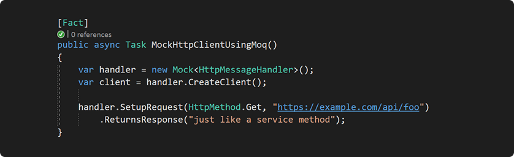

# Moq.Contrib.HttpClient

[![NuGet][nuget badge]][nuget] [![ci build badge]][ci build] ![tested on badge]

[日本語](README.ja.md)

A set of extension methods for mocking HttpClient and IHttpClientFactory with
Moq.

Mocking HttpClient has historically been [surprisingly
difficult][dotnet/runtime#14535], with the solution being to either create a
wrapper to mock instead (at the cost of cluttering the code) or use a separate
HTTP library entirely. This package provides extension methods that make mocking
HTTP requests as easy as mocking a service method.

- [Install](#install)
- [API](#api)
  - [Request](#request)
  - [Response](#response)
- [Examples](#examples)
  - [General usage](#general-usage)
  - [Matching requests by query params, headers, JSON body, etc.](#matching-requests-by-query-params-headers-json-body-etc)
  - [Setting up a sequence of requests](#setting-up-a-sequence-of-requests)
  - [Composing responses based on the request body](#composing-responses-based-on-the-request-body)
  - [Using IHttpClientFactory](#using-ihttpclientfactory)
    - [Overview](#overview)
    - [Mocking the factory](#mocking-the-factory)
    - [Named clients](#named-clients)
  - [Integration tests](#integration-tests)
  - [More in-depth examples](#more-in-depth-examples)
- [License](#license)

## Install

`Install-Package Moq.Contrib.HttpClient`

or `dotnet add package Moq.Contrib.HttpClient`

## API

The library adds request/response variants of the standard Moq methods:

- **Setup** → SetupRequest, SetupAnyRequest
- **SetupSequence** → SetupRequestSequence, SetupAnyRequestSequence
- **Verify** → VerifyRequest, VerifyAnyRequest
- **Returns(Async)** → ReturnsResponse

### Request

All Setup and Verify helpers have the same overloads, abbreviated here:

```csharp
SetupAnyRequest()
SetupRequest([HttpMethod method, ]Predicate<HttpRequestMessage> match)
SetupRequest(string|Uri requestUrl[, Predicate<HttpRequestMessage> match])
SetupRequest(HttpMethod method, string|Uri requestUrl[, Predicate<HttpRequestMessage> match])
```

`requestUrl` matches the exact request URL, while the `match` predicate allows
for more intricate matching, such as by query parameters or headers, and may be
async as well to inspect the request body.

### Response

The response helpers simplify sending a StringContent, ByteArrayContent,
StreamContent, or just a status code:

```csharp
ReturnsResponse(HttpStatusCode statusCode[, HttpContent content], Action<HttpResponseMessage> configure = null)
ReturnsResponse([HttpStatusCode statusCode, ]string content, string mediaType = null, Encoding encoding = null, Action<HttpResponseMessage> configure = null))
ReturnsResponse([HttpStatusCode statusCode, ]byte[]|Stream content, string mediaType = null, Action<HttpResponseMessage> configure = null)
```

The `statusCode` defaults to 200 OK if omitted, and the `configure` action can
be used to set response headers.

## Examples

### General usage

```csharp
// All requests made with HttpClient go through its handler's SendAsync() which we mock
var handler = new Mock<HttpMessageHandler>(MockBehavior.Strict);
var client = handler.CreateClient();

// A simple example that returns 404 for any request
handler.SetupAnyRequest()
    .ReturnsResponse(HttpStatusCode.NotFound);

// Match GET requests to an endpoint that returns json (defaults to 200 OK)
handler.SetupRequest(HttpMethod.Get, "https://example.com/api/stuff")
    .ReturnsResponse(JsonConvert.SerializeObject(model), "application/json");

// Setting additional headers on the response using the optional configure action
handler.SetupRequest(HttpMethod.Get, "https://example.com/api/stuff")
    .ReturnsResponse(stream, configure: response =>
    {
        response.Content.Headers.LastModified = new DateTime(2022, 3, 9);
    });
```

<blockquote>
<details>
<summary>💡 Why you should use MockBehavior.Strict for HttpClient</summary>
<br />

Consider the following:

```csharp
handler.SetupRequest(HttpMethod.Get, "https://example.com/api/foos")
    .ReturnsJsonResponse(expected);

List<Foo> actual = await foosService.GetFoos();

actual.Should().BeEquivalentTo(expected);
```

This test fails unexpectedly with the following exception:

```
System.InvalidOperationException : Handler did not return a response message.
```

This is because Moq defaults to Loose mode which returns a default value if no setup matches, but HttpClient throws an InvalidOperationException if it receives null from the handler.

If we change it to MockBehavior.Strict:

```diff
- var handler = new Mock<HttpMessageHandler>();
+ var handler = new Mock<HttpMessageHandler>(MockBehavior.Strict);
```

We get a more useful exception that also includes the request that was made (here we see the URL was typo'd as "foo" instead of "foos"):

```
Moq.MockException : HttpMessageHandler.SendAsync(Method: GET, RequestUri: 'https://example.com/api/foo', Version: 1.1, Content: <null>, Headers:
{
}, System.Threading.CancellationToken) invocation failed with mock behavior Strict.
All invocations on the mock must have a corresponding setup.
```

</details>
</blockquote>

### Matching requests by query params, headers, JSON body, etc.

```csharp
// The request helpers can take a predicate for more intricate request matching
handler.SetupRequest(r => r.Headers.Authorization?.Parameter != authToken)
    .ReturnsResponse(HttpStatusCode.Unauthorized);

// The predicate can be async as well to inspect the request body
handler
    .SetupRequest(HttpMethod.Post, url, async request =>
    {
        // This setup will only match calls with the expected id
        var json = await request.Content.ReadAsStringAsync();
        var model = JsonConvert.DeserializeObject<Model>();
        return model.Id == expected.Id;
    })
    .ReturnsResponse(HttpStatusCode.Created);

// This is particularly useful for matching URLs with query parameters
handler
    .SetupRequest(r =>
    {
        Url url = r.RequestUri;
        return url.Path == baseUrl.AppendPathSegment("endpoint") &&
            url.QueryParams["foo"].Equals("bar");
    })
    .ReturnsResponse("stuff");
```

The last example uses a URL builder library called [Flurl] to assist in checking
the query string. See "MatchesCustomPredicate" and "MatchesQueryParameters" in
the [request extension tests][RequestExtensionsTests] for further explanation.

### Setting up a sequence of requests

Moq has two types of sequences:

1. `SetupSequence()` which creates one setup that returns values in sequence,
   and
2. `InSequence().Setup()` which creates multiple setups under `When()`
   conditions to ensure that they only match in order.

Both of these are supported; however, as with service methods, regular setups
are generally most appropriate. The latter type can be useful, though, for cases
where separate requests independent of each other (that is, not relying on
information returned from the previous) must be made in a certain order.

See the [sequence extensions tests][SequenceExtensionsTests] for examples.

### Composing responses based on the request body

The normal Returns method can be used together with the request helpers for more
complex responses:

```csharp
handler.SetupRequest("https://example.com/hello")
    .Returns(async (HttpRequestMessage request, CancellationToken _) => new HttpResponseMessage()
    {
        Content = new StringContent($"Hello, {await request.Content.ReadAsStringAsync()}")
    });

var response = await client.PostAsync("https://example.com/hello", new StringContent("world"));
var body = await response.Content.ReadAsStringAsync(); // Hello, world
```

### Using IHttpClientFactory

#### Overview

It's common to see HttpClient wrapped in a `using` since it's IDisposable, but
this is, rather counterintuitively, incorrect and [can lead to the application
eating up sockets][httpclientwrong]. The standard advice is to reuse a single
HttpClient, yet this has the drawback of not responding to DNS changes.

ASP.NET Core introduces an [IHttpClientFactory] which "manages the pooling and
lifetime of underlying HttpClientMessageHandler instances to avoid common DNS
problems that occur when manually managing HttpClient lifetimes." As a bonus, it
also makes HttpClient's [ability to plug in middleware][middleware] more
accessible &mdash; for example, using [Polly] to automatically handle retries
and failures.

#### Mocking the factory

If your classes simply receive an HttpClient injected via IHttpClientFactory,
the tests don't need to do anything different. If the constructor takes the
factory itself instead, this can be mocked the same way:

```csharp
var handler = new Mock<HttpMessageHandler>();
var factory = handler.CreateClientFactory();
```

This factory can then be passed into the class or [injected via
AutoMocker][AutoMocker], and code calling `factory.CreateClient()` will receive
clients backed by the mock handler.

#### Named clients

The `CreateClientFactory()` extension method returns a mock that's already set
up to return a default client. If you're using [named clients], a setup can be
added like so:

```csharp
// Configuring a named client (overriding the default)
Mock.Get(factory).Setup(x => x.CreateClient("api"))
    .Returns(() =>
    {
        var client = handler.CreateClient();
        client.BaseAddress = ApiBaseUrl;
        return client;
    });
```

> Note: If you're getting a "Extension methods (here:
> HttpClientFactoryExtensions.CreateClient) may not be used in setup /
> verification expressions." error, make sure you're passing a string where it
> says `"api"` in the example.

### Integration tests

For [integration tests], rather than replace the IHttpClientFactory
implementation in the service collection, it's possible to leverage the existing
DI infrastructure and configure it to use a mock handler as the "primary"
instead:

```csharp
public class ExampleTests : IClassFixture<WebApplicationFactory<Startup>>
{
    private readonly WebApplicationFactory<Startup> factory;
    private readonly Mock<HttpMessageHandler> githubHandler = new();

    public ExampleTests(WebApplicationFactory<Startup> factory)
    {
        this.factory = factory.WithWebHostBuilder(builder =>
        {
            builder.ConfigureTestServices(services =>
            {
                // For the default (unnamed) client, use `Options.DefaultName`
                services.AddHttpClient("github")
                    .ConfigurePrimaryHttpMessageHandler(() => githubHandler.Object);
            });
        });
    }
```

This way, the integration tests use the same dependency injection and HttpClient
configurations from `ConfigureServices()` (or Program.cs) as would be used in
production.

See [this sample ASP.NET Core app][IntegrationTestExample.Web] and [its
integration test][IntegrationTestExample.Test] for a working example.

### More in-depth examples

The library's own unit tests have been written to serve as examples of the
various helpers and different use cases:

- **[Request extensions tests][RequestExtensionsTests]** &mdash; these cover the
  Setup & Verify helpers
- **[Response extensions tests][ResponseExtensionsTests]** &mdash; these cover
  the ReturnsResponse overloads
- **[Sequence extensions tests][SequenceExtensionsTests]** &mdash; these
  demonstrate mocking explicit sequences, as mentioned above

## License

MIT

[nuget]: https://www.nuget.org/packages/Moq.Contrib.HttpClient/
[nuget badge]: https://img.shields.io/nuget/dt/Moq.Contrib.HttpClient?label=Downloads&logo=nuget&logoColor=959da5&labelColor=2d343a&color=2dbb4e
[ci build]: https://github.com/maxkagamine/Moq.Contrib.HttpClient/actions?query=workflow%3A%22CI+build%22
[ci build badge]: https://github.com/maxkagamine/Moq.Contrib.HttpClient/workflows/CI%20build/badge.svg?branch=master&event=push
[tested on badge]: https://img.shields.io/badge/dynamic/xml?label=tested%20on&query=translate%28%2F%2FPropertyGroup%2FTargetFrameworks%2C%22%3B%22%2C%22%EF%BD%9C%22%29&url=https%3A%2F%2Fraw.githubusercontent.com%2Fmaxkagamine%2FMoq.Contrib.HttpClient%2Fmaster%2FMoq.Contrib.HttpClient.Test%2FMoq.Contrib.HttpClient.Test.csproj&color=555&labelColor=2d343a

[RequestExtensionsTests]: Moq.Contrib.HttpClient.Test/RequestExtensionsTests.cs
[ResponseExtensionsTests]: Moq.Contrib.HttpClient.Test/ResponseExtensionsTests.cs
[SequenceExtensionsTests]: Moq.Contrib.HttpClient.Test/SequenceExtensionsTests.cs
[IntegrationTestExample.Web]: IntegrationTestExample/IntegrationTestExample.Web/Startup.cs
[IntegrationTestExample.Test]: IntegrationTestExample/IntegrationTestExample.Test/ExampleTests.cs

[IHttpClientFactory]: https://docs.microsoft.com/en-us/aspnet/core/fundamentals/http-requests
[middleware]: https://docs.microsoft.com/en-us/aspnet/core/fundamentals/http-requests#outgoing-request-middleware
[named clients]: https://docs.microsoft.com/en-us/aspnet/core/fundamentals/http-requests#named-clients
[integration tests]: https://docs.microsoft.com/en-us/aspnet/core/test/integration-tests

[AutoMocker]: https://github.com/moq/Moq.AutoMocker
[dotnet/runtime#14535]: https://github.com/dotnet/corefx/issues/1624
[Flurl]: https://flurl.io/docs/fluent-url/
[httpclientwrong]: https://aspnetmonsters.com/2016/08/2016-08-27-httpclientwrong/
[Polly]: https://github.com/App-vNext/Polly#polly
